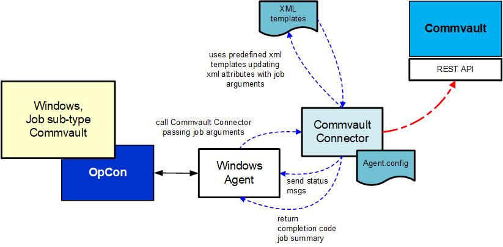

# CommVault Connector overview

## What is it?

The CommVault Connector is an OpCon connector for Windows that uses the CommVault REST API to submit backup jobs to CommVault and track their progress. It allows OpCon to schedule and monitor CommVault backup operations as part of an automated workflow.

The CommVault software platform delivers a holistic approach to data and information management. Within the platform, tightly integrated software delivers functionality throughout physical and virtual environments to protect and recover data, manage costs and complexity, and provide insight into your information.

The current connector is installed on a Windows environment. It communicates with the CommVault system using the CommVault REST API. Job definitions are passed to the connector as arguments on the command line.

## How it works

The CommVault Connector follows this sequence for each job:

1. Receives job arguments from OpCon.
2. Reads the defined XML template and updates the template values with the provided arguments.
3. Uses the QCommand/qoperation function to submit the request to CommVault.
4. Tracks the progress of the job in CommVault and updates the job status in OpCon Operations views as the status changes.
5. Retrieves the Job Summary when the job completes and adds it to the OpCon Job Log.

## FAQs

**What OpCon component does the CommVault Connector require?**
The connector requires a Windows OpCon Agent to provide the connection between the OpCon system and the CommVault Connector software.

**What interface does OpCon use to communicate with CommVault?**
The connector communicates with CommVault using the CommVault REST API via the QCommand/qoperation function.

**Where is job status visible during a CommVault backup?**
Job status updates appear in the OpCon Operations views as the job progresses. When the job completes, the Job Summary is added to the OpCon Job Log.

**What environment is required to run the connector?**
The connector runs on a Windows environment and requires Java version 11. An embedded Java Runtime Environment 11 is included in the delivery package.

## Glossary

**CommVault Connector**
A Windows-based OpCon connector that communicates with CommVault via the CommVault REST API to submit and track backup jobs.

**QCommand/qoperation**
The CommVault command-line interface used by the connector to submit backup requests to CommVault.

**XML template**
A file that defines the structure of a CommVault backup request. The connector updates values in the template in memory before submitting the request — the template file itself is not modified.

**OpCon**
The Operations Console Cross-Platform Scheduler, the workload automation platform that uses the CommVault Connector to schedule backup jobs.

**Job Summary**
The CommVault-generated summary of a completed backup job, which the connector retrieves and adds to the OpCon Job Log on completion.
